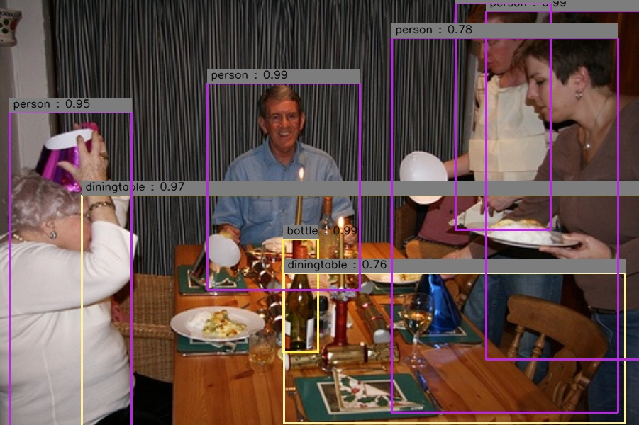

# Relation Networks for Object Detection
### Relation Networks for Object Detection reproducing project with tensorflow project<br>
[Relation Networks for Object Detection](https://arxiv.org/abs/1711.11575)<br>
[Paper Review](https://github.com/kwonsungil/Relation-Networks-for-Object-Detection-tensorflow/tree/final-branch/docs/Relation%20Networks%20for%20Object%20Detection.pdf)<br>

### 프로젝트를 크게 2개로 분리
1. backbone network인 Faster-RCNN 구현
 - https://github.com/kwonsungil/Faster-RCNN

2. 기존 Faster-RCNN model을 이용하여 논문의 핵심인 Relation Module을 구현하고 테스트
 - Faster-RCNN : https://github.com/LongJun123456/Faster-rcnn-tensorflow
 - Relation Networks for Object Detection : https://github.com/kwonsungil/Relation-Networks-for-Object-Detection-tensorflow

### 일정(https://github.com/rp12-study/rp12-hub/wiki)  
1. Paper Review(완료)<br>
2. ResNet 구현 및 ImageNet학습(완료)<br>
3. Faster-RCNN 구현 및 학습(진행 중)<br>
4. Relation Module 구현 및 학습(완료)<br>
5. Duplicate Remover 구현 및 학습(완료)<br>
5. Duplicate Remover 구현 및 학습(완료)<br>
6. Duplicate Remover loss 추가(진행 중)<br>

### 결과
1. VOC2007 + VOC2012으로 학습 후 VOC2007 Test 결과(Validate.py)<br>
  : MAP 0.665(base Faster-RCNN)<br>
  
  : MAP 0.611(Faster-RCNN + Relation Module)<br>
  
  
  
### Core Module
1. Relation Module
 : core/relation_module.py
 ```
 python core/relation_module.py
 ```
 
 
2. Duplicate Remover
  : core/relation_module.py
  ```
  python core/relation_module.py
  ```
  
  
### Environment
1. opencv
2. tfplot
3. tensorflow>=1.9

### Dataset, Model checkpoints files
[VOC2007 train download](http://host.robots.ox.ac.uk/pascal/VOC/voc2007/VOCtrainval_06-Nov-2007.tar)<br>
[VOC2007 test download](http://host.robots.ox.ac.uk/pascal/VOC/voc2007/VOCtest_06-Nov-2007.tar)<br>
[VOC2012 train download](http://host.robots.ox.ac.uk/pascal/VOC/voc2012/VOCtrainval_11-May-2012.tar)<br>

```
  ├── dataset
      ├── VOCdevkit
      │   ├── VOC2007_trainval
      │       ├── Annotations
      │       ├── JPEGImages
      |       ├── ImageSets
      │   ├── VOC2007_test
      │       ├── Annotations
      │       ├── JPEGImages
      |       ├── ImageSets
      │   ├── VOC2012_trainval
      │       ├── Annotations
      │       ├── JPEGImages
      │       ├── ImageSets
```

Downloads Resnet checkpoints(resnet_v2_101.ckpt)
[Download](https://drive.google.com/open?id=14SbExSsNi4Lfkx-euhtUbMqbEcsS1vfj)
```
  ├── ROOT
      ├── model_pretrained
      │   ├── resnet_v2_101.ckpt
```

Downloads Faster RCNN baseline
[Download](https://drive.google.com/open?id=1cCjkkLi07flLTRYw5--EYLYYy7yvDMPG)
```
  ├── ROOT
      ├── output_baseline
      │   ├──checkpoint
      │   ├──output.model-70000output.model-70000.meta
      │   ├──output.model-70000.index
      │   ├──output.model-70000.meta
```

Downloads Faster RCNN relation
[Download](https://drive.google.com/open?id=1Vv_4tq3eWeuWrmyGo_vnrC--QS5wRl_c)
```
  ├── ROOT
      ├── output_relation
      │   ├──checkpoint
      │   ├──output.model-70000output.model-70000.meta
      │   ├──output.model-70000.index
      │   ├──output.model-70000.meta
```

### 학습
```
1. config.py 파일 수정 
  - line10 : PASCAL_PATH 수정 (dataset 위치)
  - lie49 ~50 : OUTPUT_DIR을 수정하여 baseline으로 학습할지 realation moudle로 학습할지 설정
  - OUTPUT_DIR : ckpt 파일 저장 위치
  - test_output_path : test 결과 파일 저장 
2. models/network.py 파일 (config.py OUTPUT_DIR을 보고 자동 선택)
  - _head_to_tail_base : 2 fully connected layers
  - _head_to_tail_relation : 2 fully connected layers + 2 relation modules
3. train.py 실행
```

### 테스트
```
1. 학습과 마찬가지로 config.py 수정(OUTPUT_DIR을 수정하여 baseline or relation 선택)
2. validate.py 실행
```

### 이미지 inferecne
```
1. 학습과 마찬가지로 config.py 수정(OUTPUT_DIR을 수정하여 baseline or relation 선택)
2. inference_image.py 실행
```

